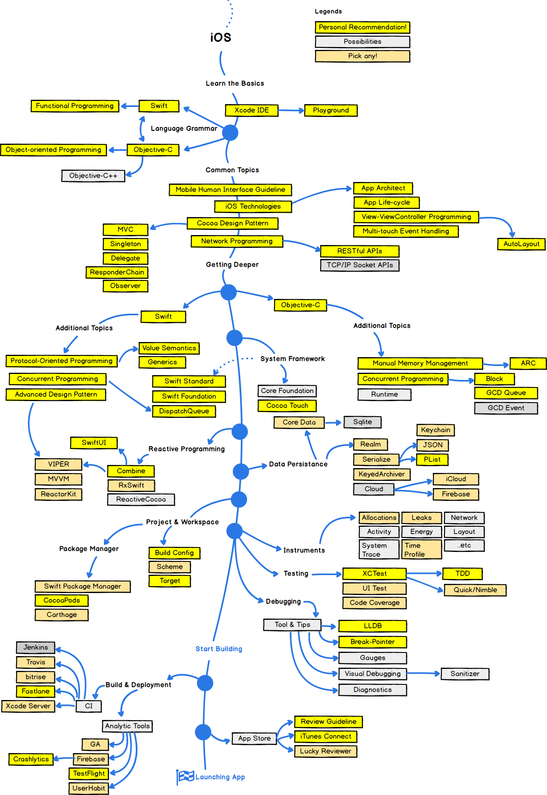

# 본인 소개
- 자사 iOS 수행 프로젝트
    - mTranskey (sdk)
    - Oneguard (엔터프라이즈), Oneguard serverless (sdk)
    - 해외향 Onepass (sdk) 
    - OneAccessEx (앱스토어)
    - Wallet Authenticator (sdk)

# 목차

강좌 1강

- 오리엔테이션 (강좌 방향 및 상황 체크)
- 디버깅 방법론

강좌 2강

- apple developer site (Enterprise, appstore, adhoc, test flight 등)

강좌 3~ 4강

- 인증서 및 프로비저닝 프로파일 개념
- 코드서명
- Push apns, fcm (live coding)
  - server - client

강좌 5강 

- mdm 동작방식 및 원리

강좌 5 ~6강 

- 솔루션 별 sample 연동 및 프로젝트 설정 (MTK, FIDO, 원가드)
  - RSLicense 발급 및 적용
  - Framework import 설정
  - ios bitcode, c library 사용시 bitcode 옵션

강좌 7강 ~ 8강

- Swift 프로젝트에서 Object-c library 만들어 사용
- Objective-c 프로젝트에서 Swift library 만들어 사용

강좌 9강 ~ 10강

- Resource image(assets), String (다국어 처리)
- 의존성 툴(Cocoapod, 카르타고) 소개
- TestCase, TDD

---

## 1강

- developer roadmap 소개

- 디버깅 방법론 (Live 코딩)
  - break points / LLDB - https://lldb.llvm.org/use/map.html
  - crash report
  - try / catch

---

## 2강

- 애플의 신제품 릴리즈 패턴
  
  - 매년 6월 즈음, WWDC 스티븐잡스, 팀쿡 CEO의 키노트 발표 (PPT) 
    - 소프트웨어 개발자들을 위한 기술발표. 한국 시간 새벽 2시
  - 사전에 개발자 초대(유료) -> 코로나 이후 온라인(무료)
    - Q&A 및 이벤트 등
  - 이후 매년 9월 새로운 iOS 출시전 Beta 릴리즈
    - 개발자는 WWDC에서 발표했던 내용들을 beta에서 확인, 디버그 리포팅
  - 매년 10월 안정화 된 새로운 iOS 정식 출시와 더불어 새로운 기기 출시
  
- 애플 개발자 계정

  - 개인, 중소기업, 기관에서 용도에 맞는 프로그램 선택 (appstore, enterprise, dep 등)
  - 프로그램내 개개인의 계정 권한 부여 
    - 앱 개발부터 출시까지 분리되진 권한, 허가 존재
    - 엔터프라이즈, 앱스토어계정을 운영하며 개발 팀내 담당자들이 권한을 부여받고 업무진행

  

- 개발자 계정 도움말 
  
  - https://help.apple.com/developer-account/#/
  
- 계정 종류

  - 중소기업 - App Store Small Business
    - https://developer.apple.com/kr/app-store/small-business-program/
  - 개인 - App Store (₩129000)
    - https://developer.apple.com/kr/programs/enroll/
    - test flight

      - ad-hoc 배포 방식처리 테스트 기기 소유자로부터 UUID를 받지 않아도 됨
      - 배포 후 앱 테스트 관련 통계 제공

      - 테스트 기기 소유자만큼의 애플 계정 생성 (번거로움)

      - 순서
        - 앱 Archive
          - distribute app 
          - iOS App Store
          - upload to App Store Connect

        - 업로드한 바이너리가 성공적으로 등록이 되면 애플에서 메일 수신

        - App Store Connect 페이지 -> TestFlight 이동
          - 새그룹 추가
          - 빌드 탭 선택 후 upload한 바이너리 선택
          - 로그인정보 입력
          - 애플 심사

        - 애플이 제공하는 두가지 방식의 테스트 
          - 자신이 알고있는 테스터를 추가하는 방법
            - 테스트 할 email 정보 입력 (테스트 앱스토어 사용자 계정)
            - 계정으로 메일발송되어 다운로드 가능
          - 공개 URL을 생성하여 이 링크를 배포하는 방법
            - 공개링크 선택하여 링크를 실행하면 모두가 다운로드 가능
  - 기업 - 엔터프라이즈 계정 (₩ 355000)
    - https://developer.apple.com/kr/programs/enterprise/
  - 기관, 교육 - Apple Business Manager / Apple School Manager (DEP)
    - https://business.apple.com/#enrollment
    - https://support.apple.com/ko-kr/HT204142

- 계정 권한  (계정 종류 별)

  - https://developer.apple.com/kr/support/roles/#adep

---

## 3강
